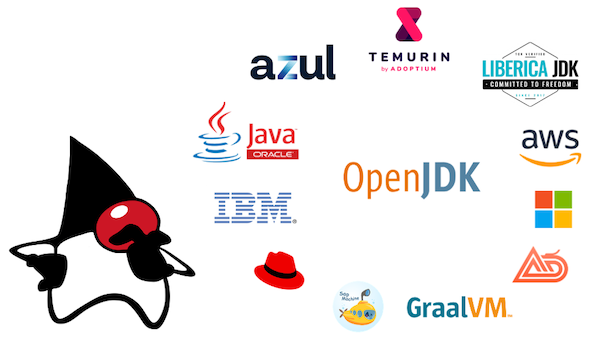

# 我应该使用哪个版本的 JDK？



构建和运行 Java 应用程序需要实现 Java 平台标准版（“Java SE”）规范的 Java 编译器、Java 运行库和虚拟机。

[OpenJDK](https://openjdk.java.net) 是 Java SE 规范的开放源代码参考实现，但它仅是源代码。不同供应商为多个支持的平台提供二进制发行版。这些发行版在许可证、商业支持、支持的平台和更新频率方面有所不同。

本网站提供独立且具有个人观点的建议。


## TL;DR

✅ 推荐: 使用 [Adoptium Eclipse Temurin 21](#adoptium-eclipse-temurin)，并确保本地版本与 CI 和生产版本一致。 

## 发布版本

在当前的 [JDK 发布模式](https://openjdk.java.net/projects/jdk/) 下, 每六个月计划发布一个带有新主版本号的新特性版本，分别在 3 月和 9 月。此外，还有季度性错误修复更新。

每两年，九月份的发布将是一个长期支持（LTS）版本，该版本至少会更新三年。


| JDK 版本                                        | 类型    |  发布日期 | 突出特点         | 推荐方案                                                                                                                                                                                                                     |
|-----------------------------------------------------|---------|--------------|--------------------|-------------------------------------------------------------------------------------------------------------------------------------------------------------------------------------------------------------------------------------|
| [**8**](https://openjdk.java.net/projects/jdk8/)    | **LTS** | **03/2014**  | Lambdas            | Last LTS version under previous release model. Free updates by Oracle [ended](https://www.oracle.com/java/technologies/java-se-support-roadmap.html), but still maintained by others. Upgrade to 17 or 21 now! |
| [9](https://openjdk.java.net/projects/jdk9/)        | Feature | 09/2017	     | Modules            | New release model was introduced. EOL. Upgrade to 17 or 21 now!                                                                                                                                                                     |
| [10](https://openjdk.java.net/projects/jdk/10/)     | Feature | 03/2018	     | var                | EOL. Upgrade to 17 or 21 now!                                                                                                                                                                                                       |
| [**11**](https://openjdk.java.net/projects/jdk/11/) | **LTS** | **09/2018**	 | New HTTP Client    | Upgrade to 21 now!                                                                                                                                                          |
| [12](https://openjdk.java.net/projects/jdk/12/)     | Feature | 03/2019	     |                    | EOL. Upgrade to 21 now!                                                                                                                                                                                                             |
| [13](https://openjdk.java.net/projects/jdk/13/)     | Feature | 09/2019	     |                    | EOL. Upgrade to 21 now!                                                                                                                                                                                                             |
| [14](https://openjdk.java.net/projects/jdk/14/)     | Feature | 03/2020	     | Switch expressions | EOL. Upgrade to 21 now!                                                                                                                                                                                                             |
| [15](https://openjdk.java.net/projects/jdk/15/)     | Feature | 09/2020	     | Text blocks        | EOL. Upgrade to 21 now!                                                                                                                                                                                                             |
| [16](https://openjdk.java.net/projects/jdk/16/)     | Feature | 03/2021	     | Records            | EOL. Upgrade to 21 now!                                                                                                                                                                                                             |
| [**17**](https://openjdk.java.net/projects/jdk/17/) | **LTS** | **09/2021**	 | Sealed Classes     | **Supported LTS version.** Consider upgrading to 21 in the next months.                                                                                                                                                                                                             |
| [18](https://openjdk.java.net/projects/jdk/18/)     | Feature | 03/2022	     | [UTF-8 by Default](https://openjdk.java.net/jeps/400)   | EOL. Upgrade to 21 now!                                                                                                                                                            |
| [19](https://openjdk.java.net/projects/jdk/19/)     | Feature | 09/2022	     |                    | EOL. Upgrade to 21 now!                                                                                                                                                            |
| [20](https://openjdk.java.net/projects/jdk/20/)     | Feature | 03/2023	     |                    | EOL. Upgrade to 21 now!                                                                                                                                                            |
| [**21**](https://openjdk.java.net/projects/jdk/21/)     | **LTS** | **09/2023**	     | [Pattern Matching](https://wscp.dev/posts/tech/java-pattern-matching/), Virtual Threads                   | **Current LTS version.**                                                                                                                                                           |
| [22](https://openjdk.java.net/projects/jdk/22/)     | Feature | 03/2024	     |                     | Stick with 21.                                                                                                                                                            |
| [23](https://openjdk.java.net/projects/jdk/23/)     | Feature | 09/2024	     | [Markdown Documentation Comments](https://openjdk.org/jeps/467)                  | Stick with 21.                                                                                                                                                            |


您需要决定是想坚持使用最新的长期支持版本，还是选择使用最新的特性版本并每六个月进行一次升级。这两种选择都可以，但如果您不确定，请坚持使用最新的长期支持版本。

OpenJDK 项目本身在 [openjdk.java.net](https://openjdk.java.net) 上进行管理，您可以在那里找到规范、源代码和邮件列表，但那里没有可以下载的构建版本。您需要选择一个发行版。

## 发行版

- [OpenJDK builds by Oracle (jdk.java.net)](#openjdk-builds-by-oracle-jdkjavanet)
- [Oracle Java SE Development Kit (JDK)](#oracle-java-se-development-kit-jdk)
- [Adoptium Eclipse Temurin](#adoptium-eclipse-temurin)
- [AdoptOpenJDK](#adoptopenjdk)
- [Azul Zulu](#azul-zulu)
- [Azul Zing](#azul-zing)
- [BellSoft Liberica JDK](#bellsoft-liberica-jdk)
- [IBM Semeru Runtime](#ibm-semeru-runtime)
- [Amazon Corretto](#amazon-corretto)
- [Microsoft Build of OpenJDK](#microsoft-build-of-openjdk)
- [Alibaba Dragonwell](#alibaba-dragonwell)
- [SapMachine](#sapmachine)
- [Red Hat OpenJDK](#red-hat-openjdk)
- [GraalVM](#graalvm)


### OpenJDK builds by Oracle (jdk.java.net)

[网站](https://jdk.java.net) |
[Releases](https://jdk.java.net) |
Docker Images (n/a)

Oracle 为 Linux、macOS 和 Windows 提供 OpenJDK 构建版本，以压缩归档格式提供。

这些构建版本将在 6 个月的时间内进行更新。在此短暂期限之后，将不再提供更新和安全补丁。这也适用于 LTS 版本！例如，最新的
e.g., OpenJDK 11 构建版本是  [11.0.2+9](https://jdk.java.net/archive/) 而当前的 OpenJDK 版本是 [11.0.12+7](https://wiki.openjdk.java.net/display/JDKUpdates/JDK11u).

⛔️  建议：不要使用 Oracle 的 OpenJDK 构建，尤其是如果您打算坚持使用 LTS 版本。


### Oracle Java SE Development Kit (JDK)

[Website](https://www.oracle.com/java/) |
[Releases](https://www.oracle.com/java/technologies/downloads/archive/) |
Docker Images (n/a)

Oracle 提供基于 OpenJDK 的商业版本，这些版本与 OpenJDK 的源代码完全相同：Oracle Java SE 开发工具包（JDK）。Oracle 为这些构建提供定期更新和安全补丁。

这些构建的主要问题是 Oracle 的许可政策：

在版本 10 之前，构建是在 [Oracle Binary Code License Agreement](https://www.oracle.com/de/downloads/licenses/binary-code-license.html)下发布的, 这实际上允许构建用于商业项目。

从版本 11 到版本 16 的构建是在 [Oracle Technology Network License Agreement for Oracle Java SE](https://www.oracle.com/downloads/licenses/javase-license1.html),下发布的 Oracle Java SE，这需要付费许可才能在生产中使用。这就是为什么出现了许多新的 OpenJDK 发行版。

版本 17 是在 [Oracle No-Fee Terms and Conditions (NFTC)](https://www.oracle.com/downloads/licenses/no-fee-license.html), 下发布的，这允许使用构建来运行内部业务运营。不幸的是，“内部业务运营”这个短语没有定义，是一个非常模糊的短语（一个面向公众的网站是否属于内部业务运营？）。

此外，基于这种不稳定的许可历史，未来版本将如何许可是不可预测的。

⛔️ 建议：在咨询律师之前，不要使用 Oracle Java SE 开发工具包（JDK）。


### Adoptium Eclipse Temurin

[Website](https://adoptium.net) |
[Releases](https://adoptium.net/archive.html) |
[Docker Images](https://hub.docker.com/_/eclipse-temurin/)

Eclipse Adoptium is a top-level project under the Eclipse Foundation, which provides resources and a professional governance model for open source software.
The Adoptium Working Group consists of major companies and organizations that have a strategic interest in the Java technology, including Red Hat, IBM, Microsoft, Azul, and the iJUG. The former AdoptOpenJDK project has moved to Eclipse Adoptium.

The Adoptium OpenJDK builds are called _Eclipse Temurin_ to distinguish the project from the builds. 

Eclipse Temurin builds are high-quality, vendor-neutral, and TCK-tested under a permissive license.

Adoptium states, it will continue to build binaries for LTS releases as long as the corresponding upstream source is actively maintained.

✅ Recommendation: _Adoptium Eclipse Temurin_ OpenJDK builds are highly recommended.


### AdoptOpenJDK

[Website](https://adoptopenjdk.net) |
[Releases](https://adoptopenjdk.net/archive.html?variant=openjdk11&jvmVariant=hotspot) |
[Docker Images](https://hub.docker.com/_/adoptopenjdk)

The AdoptOpenJDK project was the predecessor of Eclipse Adoptium and provided high-quality OpenJDK builds, both for the default HotSpot and the OpenJ9 virtual machine.

The website and older releases are kept online to access archived releases.

⛔️ Recommendation: Do not use _AdoptOpenJDK_ anymore. Use _Adoptium Eclipse Temurin_ instead.


### Azul Zulu

[Website](https://www.azul.com) |
[Releases](https://www.azul.com/downloads/?package=jdk#download-openjdk) |
[Docker Images](https://hub.docker.com/r/azul/zulu-openjdk)

Azul Zulu Builds of OpenJDK are no-cost, production-ready open-source, TCK-tested, and certified OpenJDK distributions. 
They are available for a wide range of hardware platforms and operating systems and are compatible with special requirements, 
such as stripped-down JREs and builds, including OpenJFX and Coordinated Restore at Checkpoint (CRaC). 

They are supported as part of Azul Platform Core, which provides stabilized security updates for rapid, assured deployment 
into production and solution-oriented engineering assistance.

A downside of these builds is the dependency to a single company, that may suddenly change its license or update policies.

✅ Recommendation: _Azul Zulu Builds of OpenJDK_ are a good choice.


### Azul Zing

[Website](https://www.azul.com) |
[Releases](https://www.azul.com/products/prime-roadmap/) |
[Docker Images](https://hub.docker.com/u/azul)

Azul Zing Builds of OpenJDK (Zing) are commercial optimized builds of OpenJDK, currently marketed as Azul Platform Prime. Zing is free for evaluation but requires a commercial contract with Azul Systems for production use. 

Zing takes OpenJDK as its base and replaces several key components with optimized versions. The major additions are the C4 Pauseless Garbage Collector (the only generational, production tested pauseless garbage collection available for all major Java versions, including Java 8 and 11), the Falcon JIT Compiler (optimizes code for faster throughput, lower response latencies, and greater carrying capacity), the ReadyNow Warmup Optimizer (learns from previous runs of your application to bring applications to full speed as quickly as possible), and Azul Optimizer Hub (a separate component that offloads JIT compilation from your client machines and lets JVMs learn from each other to reach maximum speed as quickly as possible).

Zing is a good choice for latency-sensitive applications that need to guarantee low median latency and minimum latency outliers, applications that aggressively scale up and down and need to be ready to handle traffic as soon as possible, and large fleets of JVMs running an application where the cost of infrastructure is an issue. 

⚠️ Recommendation: Consider _Azul Zing / Azul Platform Prime_ when GC pause times, slow warmup, and large on-prem infrastructure or Cloud costs are a problem. Do not use it in production without a license. 


### BellSoft Liberica JDK

[Website](https://bell-sw.com) |
[Releases](https://bell-sw.com/pages/downloads/?) |
[Docker Images](https://hub.docker.com/u/bellsoft)

Similar to Azul, BellSoft has specialized in professional Java technologies and commercial support for JDK.
Also, BellSoft has a high industry reputation and is engaged in various working groups to evolve the Java platform.

BellSoft provides open source OpenJDK builds called _Liberica JDK_ for pretty much all operating systems and architectures.

The popular Spring Boot framework chose Liberica JDK as runtime for their [buildpack](https://github.com/paketo-buildpacks/bellsoft-liberica).

A downside of these builds is the dependency to a single company, that may suddenly change its license or update policies.

✅ Recommendation: _BellSoft Liberica JDK_ builds are a good choice.


### IBM Semeru Runtime

[Website](https://developer.ibm.com/languages/java/semeru-runtimes/) |
[Releases](https://developer.ibm.com/languages/java/semeru-runtimes/downloads/) |
Docker Images (n/a)

IBM developed its own version of the Java Virtual Machine, called J9 and it was open-sourced as _Eclipse OpenJ9_.
It is an alternative to the default HotSpot Java Virtual Machine, but it has never gained much popularity.

IBM now provides builds called _Semeru Runtime_ based on the Eclipse OpenJ9 Java Virtual Machine and some OpenJDK class libraries.
OpenJ9 has a [low memory footprint and starts fast with shared classes](https://www.eclipse.org/openj9/performance/), but lower throughput compared to Hotspot Virtual Machine.

⚠️ Recommendation: Use _IBM Semeru Runtime_ only if you know that you need the OpenJ9 Virtual Machine.


### Amazon Corretto

[Website](https://aws.amazon.com/corretto/) |
[Releases](https://aws.amazon.com/corretto/) |
[Docker Images](https://hub.docker.com/_/amazoncorretto)

Since Oracle changed the support and license policy for its OpenJDK builds, major cloud providers decided to establish their own managed OpenJDK builds and providing long-term updates. Apparently, this is to avoid risks, especially lawsuits against Oracle.

In 2018, AWS published _Corretto_, yet another OpenJDK build.

AWS includes back ports of bug fixes from newer OpenJDK versions and [claims](https://aws.amazon.com/corretto/faqs/) that they would add patches that might not yet be integrated in the OpenJDK project. Amazon has implemented an alternative [crypto provider](https://github.com/corretto/amazon-corretto-crypto-provider) that has been optimized for their services. It is [planned](https://aws.amazon.com/blogs/opensource/introducing-amazon-corretto-crypto-provider-accp/) to be used as the default crypto implementation in Corretto.

Amazon provides releases for major development platforms and an optimized version for its own Amazon Linux 2.

✅ Recommendation: _Corretto_ builds are a good choice, particularly if you run Java applications directly on Amazon Linux 2 in AWS.


### Microsoft Build of OpenJDK

[Website](https://www.microsoft.com/openjdk) |
[Releases](https://docs.microsoft.com/en-us/java/openjdk/download) |
[Docker Images](https://docs.microsoft.com/en-us/java/openjdk/containers)

In 2021, Microsoft published _Microsoft Build of OpenJDK_, yet another OpenJDK build.

Microsoft may include back ports of bug fixes from newer OpenJDK versions and claims that they would add patches that might not yet be integrated in the OpenJDK project.

Microsoft provides releases for major development platforms.

⚠️ Recommendation: Use _Microsoft Build of OpenJDK_, only if you run Java applications directly on Azure. There are more established options available.

### Alibaba Dragonwell

[Website](http://dragonwell-jdk.io) |
[Releases](http://dragonwell-jdk.io) |
[Docker Images](https://github.com/alibaba/dragonwell11/wiki/Use-Dragonwell-11-docker-images)

Alibaba provides an OpenJDK build which includes back ports and some _extra features_.

⛔️ Recommendation: Do not use _Alibaba Dragonwell_, unless you are forced by your government.


### SapMachine

[Website](https://sap.github.io/SapMachine/) |
[Releases](https://github.com/SAP/SapMachine/releases) |
[Docker Images](https://hub.docker.com/_/sapmachine)

SapMachine is yet another OpenJDK Build, maintained by SAP.

⚠️ Recommendation: Use _SapMachine_ only if you are running Java applications on SAP servers. There are more established options available.


### Red Hat OpenJDK

[Website](https://developers.redhat.com/products/openjdk/overview) |
[Releases](https://developers.redhat.com/products/openjdk/download) |
[Docker Images](https://catalog.redhat.com/software/containers/ubi8/openjdk-11/5dd6a4b45a13461646f677f4)

Red Hat provides OpenJDK builds for LTS versions.

⚠️ Recommendation: Use _Red Hat OpenJDK_ only if you are running Java applications directly on Red Hat Enterprise Linux. There are more established options available.


### ojdkbuild

[Website](https://github.com/ojdkbuild/ojdkbuild) |
[Releases](https://github.com/ojdkbuild/ojdkbuild/releases  ) |
Docker Images (n/a)

The project is discontinued.
The ojdkbuild project had the goal of providing Windows x86_64 binaries of OpenJDK that are as close in behaviour to Linux OpenJDK packages as possible, e.g. by using system libraries instead of packaged versions of zlib or OpenSSL.
It used the packages included in CentOS.
A use case for these builds was to develop Java software on Windows machines and deploy them to Linux servers in production.

⛔️ Recommendation: Do not use _ojdkbuild_, as the project is discontinued.


### GraalVM

[Website](https://www.graalvm.org) |
[Releases](https://github.com/graalvm/graalvm-ce-builds/releases) |
[Docker Images](https://github.com/graalvm/container/pkgs/container/graalvm-ce)

GraalVM is a fully compliant JDK, but much different from all the others builds.

GraalVM was developed by Oracle. 
It is based on the OpenJDK but includes a new high-performance compiler and a new polyglot virtual machine (can execute code written in different programming languages).
It is also possible to create platform-specific native executable that are highly optimized and start extremely fast.

🤷 Please [share](https://github.com/whichjdk/whichjdk.com/issues/6) your experiences with GraalVM in production, so that we can elaborate a validated recommendation.

## Special Cases

### Apple Silicon

The official support for _macOS/AArch64_ was implemented with [JEP 391](https://openjdk.java.net/jeps/391) in the OpenJDK 17 release.

macOS _x64_ builds run stable with Rosetta 2, but there is a significant performance drop due to emulation.
People that develop on an _Apple Silicon_ Mac (like me) should install a native macOS _AArch64_ (aka _ARM 64_) build of the JDK.

Most distributions have _macOS/AArch64_ builds for Java 17+, only.
[BellSoft Liberica](https://bell-sw.com/announcements/2021/03/12/Liberica-on-Apple-Silicon/), Amazon Corretto, and [Azul Zulu](https://www.azul.com/newsroom/azul-announces-support-of-java-builds-of-openjdk-for-apple-silicon/) also provide free _macOS/AArch64_ builds for Java 8 and Java 11.


## 问答

### 本地开发安装 JDK 最好的方式是什么？

使用 [SDKMAN!](https://sdkman.io/install)

要列出可用的 JDK，请输入
```
sdk list java
```

安装特定版本：

```
sdk install java 21.0.3-tem
```

通过检查版本来验证：

```
java --version
```


### 我目前安装了哪个版本的 Java

```
which java
`which java` --version
```

在 Linux 上，您还可以尝试
```
sudo update-java-alternatives
```

### JDK 和 JRE 之间的区别是什么？

一些发行版提供了 JDK（Java 开发工具包）和 JRE（Java 运行环境）构建。JDK 包含了编译、打包和运行 Java 应用程序所需的一切，而 JRE 只包含运行 Java 应用程序所需的二进制文件和库。JRE 是 JDK 的精简版，在兆字节大小上更小。

如果大小对您来说很重要，请考虑使用  [jlink](https://blog.adoptium.net/2021/10/jlink-to-produce-own-runtime/).创建自己的精简运行环境。

对于本地开发，你需要一个 JDK。在生产环境中，如果你只需要运行环境，使用 JDK 也可以。

### 关于 Java EE?

Java EE（Java 平台，企业版）已更名为 Jakarta EE。它是一个用于构建服务器应用程序和前端的应用程序规范。在使用上，Jakarta EE 可以与 [Spring Boot](https://spring.io/projects/spring-boot), [Micronaut](https://micronaut.io),  [Quarkus](https://quarkus.io),等现代框架相媲美，但 Jakarta EE 更复杂。

⚠️建议：不要基于 Jakarta EE 开始新的项目。大多数人使用 Spring Boot，这是一个不错的选择。如果你有强烈的 Java EE 背景，可以考虑 Quarkus。如果你喜欢 Groovy 和 Grails，可以考虑 Micronaut。


## About

本网站由 muzihuaner 汉化维护。本网站上所表达的建议或观点均为个人意见，基于长期的专业经验。作者与所列组织无关。

原项目 (https://github.com/whichjdk/whichjdk.com).

Java 和 OpenJDK 是 Oracle 及其附属公司的商标或注册商标。
